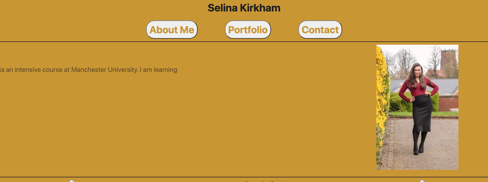

02 Advanced CSS: Portfolio

## About This Code

This code uses HTML and CSS to generate a portfolio webpage.

The web page is asimple portfolio built with HTML and CSS. It is responsive for different size screens using media query.

I have linked to three current portfolios the rest I have left blank and intend to add links in future.

## Links To Repository

You are required to submit BOTH of the following for review:

- The URL of the deployed application.

- https://github.com/Skirkzzz/week-2-homework
- https://skirkzzz.github.io/week-2-homework/
